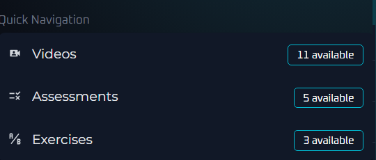
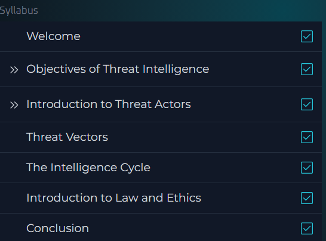

# 🛡️ Foundation Level Threat Intelligence Analyst – arcX

This repository contains **notes, labs, cheatsheets, guides, case studies, extras, and a certificate of completion** for the *Foundation Level Threat Intelligence Analyst* program by arcX.  
The course focuses on **threat intelligence concepts, OSINT, MITRE ATT&CK, threat modeling, malware analysis, reporting, and hands-on exercises**.

---

## 📚 Notes
- 📄 [01-introduction.md](./notes/01-introduction.md) – Introduction to Threat Intelligence  
- 📄 [02-threat-intelligence-basics.md](./notes/02-threat-intelligence-basics.md) – Key concepts and intelligence lifecycle  
- 📄 [03-threat-landscape.md](./notes/03-threat-landscape.md) – Overview of cyber threats and threat actors  
- 📄 [04-data-collection.md](./notes/04-data-collection.md) – OSINT and structured data collection  
- 📄 [05-data-analysis.md](./notes/05-data-analysis.md) – Analysis of collected threat data  
- 📄 [06-threat-modeling.md](./notes/06-threat-modeling.md) – Threat modeling and attack vectors  
- 📄 [07-reporting-intelligence.md](./notes/07-reporting-intelligence.md) – Creating intelligence reports  
- 📄 [08-case-studies.md](./notes/08-case-studies.md) – Selected real-world threat intelligence case studies  

---

## 🧪 Labs
- 🔧 [threat-hunting-labs.md](./labs/threat-hunting-labs.md) – Threat hunting exercises using logs and MITRE ATT&CK  
- 🔧 [malware-analysis-labs.md](./labs/malware-analysis-labs.md) – Basic malware analysis and IOC extraction  
- 🔧 [hands-on-exercises.md](./labs/hands-on-exercises.md) – Combined exercises on collection, analysis, and reporting  

---

## 📝 Cheatsheets
- 📑 [MITRE-ATTACK.md](./cheatsheets/MITRE-ATTACK.md) – Key tactics & techniques reference  
- 📑 [OSINT-tools.md](./cheatsheets/OSINT-tools.md) – Popular OSINT tools and tips  
- 📑 [attack-techniques.md](./cheatsheets/attack-techniques.md) – Overview of common attack techniques  
- 📑 [reporting-intelligence.md](./cheatsheets/reporting-intelligence.md) – Tips for writing actionable intelligence reports  
- 📑 [threat-modeling.md](./cheatsheets/threat-modeling.md) – STRIDE & MITRE ATT&CK quick reference  

---

## 📋 Extras
- 📑 [best-practices.md](./extras/best-practices.md) – Guidelines and recommendations for Threat Intelligence Analysts  
- 📑 [resources.md](./extras/resources.md) – Additional references and learning materials  
- 📑 [timeline.md](./extras/timeline.md) – Timeline of major cyber incidents  

---

## 📖 Docs
- 📘 [index.md](./docs/index.md) – Program overview  
- 📘 [syllabus.md](./docs/syllabus.md) – Course syllabus  
- 📘 [roadmap.md](./docs/roadmap.md) – Learning roadmap  
- 📘 [references.md](./docs/references.md) – External references  
- 📘 [glossary.md](./docs/glossary.md) – Key terms & definitions  

---

## 📸 Screenshots

| Step | Screenshot |
|------|------------|
| 📚 Course Navigation |  |
| 🏫 Course Syllabus |  |

---

## 📜 Certificate
🎓 [Foundation Level Threat Intelligence Analyst](./cert/Foundation%20Level%20Threat%20intelligence%20Analyst.pdf)

---

## ✍️ Personal Review
This program provides a solid foundation in **threat intelligence, OSINT, threat modeling, malware analysis, and reporting**.  
Hands-on labs and cheatsheets help learners understand **attack techniques, threat hunting, and actionable reporting**.  
Ideal for aspiring Threat Intelligence Analysts aiming to secure networks and analyze threats effectively.  

---

## ✍️ Author
**Thành Danh** – Red Team Learner & Security Researcher  

- GitHub: [@ngvuthdanhh](https://github.com/ngvuthdanhh)  
- Email: ngvu.thdanh@gmail.com  

---

## 📄 License
This project is licensed under the terms of the **MIT License**. See [LICENSE](./LICENSE) for full details.  
© 2025 ngvuthdanhh. All rights reserved.
